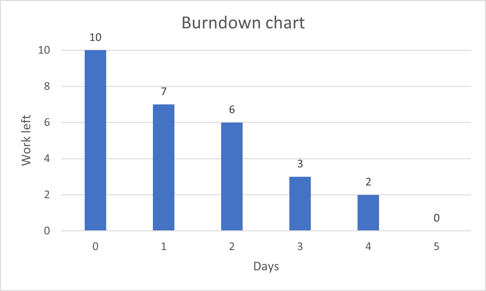

# Actual iteration-1 board, (see chapters 3 and 4), add your start and end dates 

Checklist: 
1. github entry timestamps
2. User stories are correct: see p39

* Assumed Velocity: 10
* Number of developers: 3
* Total estimated amount of work: 10 days

User stories or tasks (see chapter 4):  
Task 1.Language Change Option (US 2), priority Medium, 3 days  
Task 2.Booking Notification for Service Providers (US 4), priority Medium, 2 days  
Task 3.Schedule a Cleaning Appointment (US 5), priority Medium, 3 days  
Task 4.cleaning equipment purchase (US 6), priority Low, 2 days

In progress:
* None

Completed:
* Task 1 (Huayu Zhong), Date completed: June 15
* Task 2 (Zhicheng Liang), Date completed: June 22
* Task 3 (Chia Chang Hsu), Date completed: June 28
* Task 4 (Zhicheng Liang), Date completed: June 31

### Burn Down for iteration-1 (see chapter 4):
Update this at least once per week
* 3 weeks left, 10 days of estimated amount of work 
* 2 weeks left, 6 days
* 1 weeks left, 2 days
* 0 weeks left, 0 days
* Actual Velocity: 10

