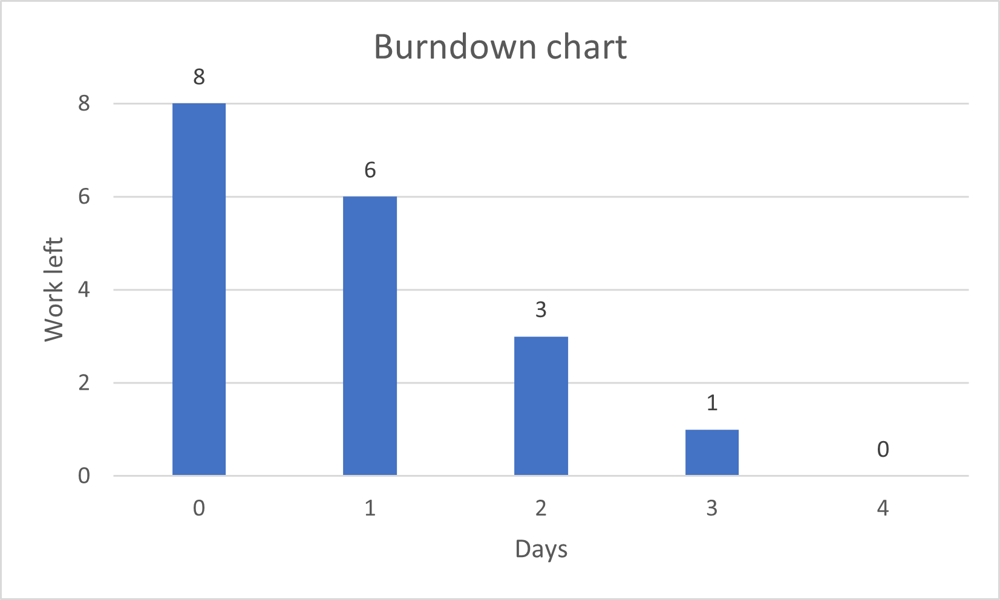

# Actual iteration-2 board, (see chapters 3 and 4), add your start and end dates 

Checklist: 
1. github entry timestamps
2. User stories are correct: see p39

* Assumed Velocity FROM iteration-1: 10 
* Number of developers: 3
* Total estimated amount of work: 8 days

User stories or tasks (see chapter 4):  
Task 1.  Schedule Management (US 1), priority High, 2 days  
Task 2.  Task Assignment for Cleaning Companies (US 3), priority Medium, 3 days  
Task 3.  Cleaner Arrival Notification (US 7), priority Low, 3 days

In progress:
* none

Completed:
* Task 1 (Huayu Zhong, Zhicheng Liang), date completed: July 10
* Task 2 (Chia Chang Hsu, Huayu Zhong), date completed: July 18
* Task 3 (Zhicheng Liang), date completed: July 29

### Burn Down for iteration-2 (see chapter 4):
Update this at least once per week
* 3 weeks left, 8 days of estimated amount of work 
* 2 weeks left, 6 days
* 1 weeks left, 3 days
* 0 weeks left, 0 days
* Actual Velocity: 8 

